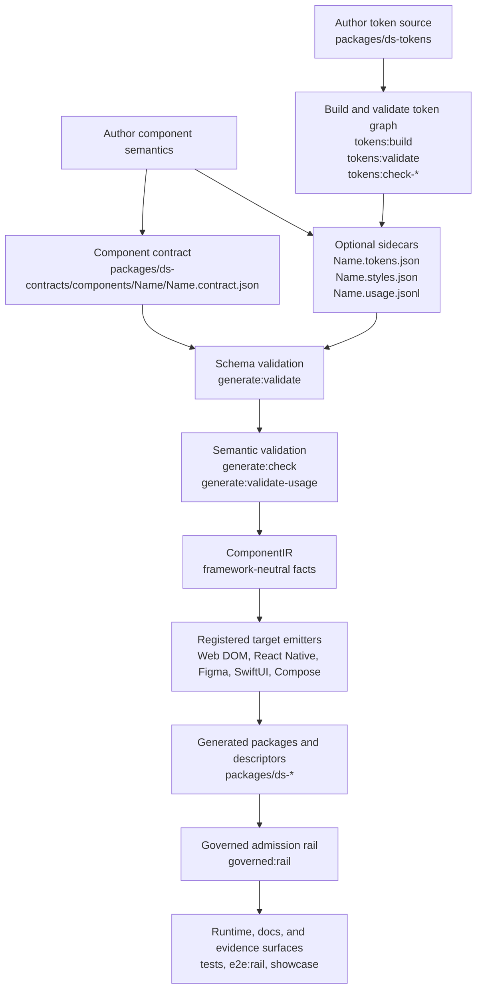

# Full Stack Design System

A contract-governed design-system experiment that generates React, Vue, Svelte, Angular, and Lit packages from JSON component contracts built on top of one polymorphic primitive — `Stack` — while also exercising governance surfaces for generated artifacts, tokens, target packs, runtime previews, design-tool descriptors, agent-facing projection, and documentation.

## Current state routing

Start with [`docs/current-implementation-snapshot.md`](docs/current-implementation-snapshot.md) when deciding what the project currently proves. Older architecture docs remain useful, but several were written before the latest implementation slices landed. The snapshot records the current claim boundary — ledger last updated <!-- snapshot-updated -->2026-09-04: what is implemented, what is CI-gated, what is only a foundation, and what remains a non-claim.

Use this README as the orientation surface. Use the snapshot as the freshness index. Use the detailed docs under `docs/` for doctrine and rationale.

## The architectural claim

This repository is not, primarily, a design system. It is a falsifiable claim about compositional systems, with a design system as the existence proof. The original falsification surface was "one primitive, one contract corpus, five Web DOM frameworks": if the same contract can drive React hooks, Vue composables, Svelte runes, Angular signals, and Lit controllers idiomatically without leaking framework detail into the contract, then the contract is carrying real semantic load.

That claim boundary has expanded. The current system also includes generated-artifact admission, token governance, target-pack registry scaffolding, Figma descriptor projection, runtime fact assertions, and partially derived component evidence pages. Those surfaces strengthen the architecture, but they do not turn the project into a proof of production adoption, complete accessibility adequacy, visual quality, live Figma publication, executable external target packs, or substrate-neutral UI semantics.

The full normal-form claim, evidence status, and falsification conditions are written down in [`docs/normal-form.md`](docs/normal-form.md). The consumer-facing stance — strict internal invariants, boring external affordances, and admitted override surfaces — is named in [`docs/architecture/consumer-projection-doctrine.md`](docs/architecture/consumer-projection-doctrine.md).

## What this is

This project is a **contract testing ground**. Every component is defined by a JSON contract that describes its anatomy, props, variants, states, styles, tokens, accessibility, types, and behavior. From that contract and its sidecars, the codegen emits framework-idiomatic component sources, behavior primitives, tests, styles, barrels, descriptors, and documentation projections.

The authoritative component corpus is discovered from `packages/ds-contracts/components/<Name>/<Name>.contract.json`. Do not treat a hand-written count in prose as authoritative. The loader in [`packages/ds-codegen/src/contracts-fs.ts`](packages/ds-codegen/src/contracts-fs.ts) owns the filesystem layout, including optional sidecars:

- `<Name>.tokens.json` — component token bindings;
- `<Name>.styles.json` — component style declarations;
- `<Name>.usage.jsonl` — curated documentation-fidelity composition examples.

The executable Web DOM packages are workspace packages today:

| Package | Corpus source |
|---|---|
| `@full-stack-ds/react` | generated from discovered contracts |
| `@full-stack-ds/vue` | generated from discovered contracts |
| `@full-stack-ds/svelte` | generated from discovered contracts |
| `@full-stack-ds/lit` | generated from discovered contracts |
| `@full-stack-ds/angular` | generated from discovered contracts |

The layout primitive is defined separately as a primitive contract: [`packages/ds-contracts/primitives/Stack.primitive.json`](packages/ds-contracts/primitives/Stack.primitive.json). Per-target import paths live under `implementation.targets.<framework>.relativeFromComponents` so each framework's generated components import the canonical primitive correctly.

## Why one primitive

Every component — from `Button` to `Dialog` to `Calendar` — is composed from `<Stack>`, a polymorphic layout primitive that renders as any HTML element:

```tsx
<Stack as="button" variant="horizontal" className="btn">
<Stack as="nav" aria-label="Main">
<Stack as="input" type="email" />
```

This constraint tests whether the contract carries enough information to describe the current component corpus across interactivity, accessibility, styling, documentation, and projection surfaces. It is evidence for the architecture, not proof that the primitive count will remain one forever.

The current witness covers:

- **Code generation** — framework-specific sources from contracts and IR;
- **Cross-framework Web DOM realization** — React, Vue, Svelte, Angular, and Lit as executable render targets;
- **Generated-artifact admission** — manifest-backed rail evidence for generated bytes;
- **Runtime fact assertions** — Playwright rail assertions for selected contract facts across all <!-- web-framework-count -->5 web frameworks;
- **Token governance** — token build, validation, contrast, brand-reference, and token-resolvability gates, plus a report-only vocabulary-usage measure;
- **Agent-to-UI projection** — A2UI descriptors derived from contracts;
- **Documentation/evidence pages** — derived anatomy, props, states, a11y, usage, A2UI, evidence, component-token, preview, and source surfaces;
- **Design-tool projection** — Figma descriptor target emitted from ComponentIR.

## Project structure

```txt
packages/
  ds-contracts/                  # Component + schema JSON source surfaces
    component.contract.schema.json
    component.tokens.schema.json
    component.styles.schema.json
    component.usage.schema.json
    components/
      <Name>/
        <Name>.contract.json      # Component contract
        <Name>.tokens.json        # Optional token sidecar
        <Name>.styles.json        # Optional style sidecar
        <Name>.usage.jsonl        # Optional curated usage examples
    primitives/
      primitive.contract.schema.json
      Stack.primitive.json        # Canonical Stack API + per-target import paths

  ds-codegen/                    # TypeScript codegen CLI + IR + emitters + rail
    src/
      cli.ts
      ir.ts                       # Framework-neutral intermediate representation
      registry.ts                 # Target registry
      target-packs/               # Target-pack manifest/config/local-loader foundation
      frameworks/
        react/
        vue/
        svelte/
        angular/
        lit/
        react-native/             # Rail-admitted 6th target
        figma/                    # Descriptor target, not live Figma publication proof
        swift/  jetpack-compose/  # Registered allowlisted targets, outside the admission rail

  ds-react/                      # Generated React package + behavior primitives
  ds-vue/                        # Generated Vue 3 SFC package + composables
  ds-svelte/                     # Generated Svelte 5 package + .svelte.ts hooks
  ds-angular/                    # Generated Angular standalone package + signals
  ds-lit/                        # Generated Lit web-components package + controllers
  ds-react-native/               # Generated RN package — rail-admitted, in the CI drift diff
  ds-swiftui/  ds-jetpack-compose/ # Generated native packages, outside the admission rail
  ds-swift-smoke/  ds-compose-smoke/ # Fixtures for the two native compile lanes
  ds-tokens/                     # Token source, build, validation, and usage gates
  ds-iconography/                # Icon authoring source + emission ledger
  ds-figma-plugin/               # Consumes generated figma descriptors

src/                            # React showcase app (Vite) — <!-- src-top-level-dir-count -->11 top-level dirs
  app.tsx                       # Shell: Header/Sidebar/TracePanel + route switch
  router.tsx                    # <!-- showcase-route-count -->12 hash routes
  views/                        # <!-- src-view-count -->16 top-level view modules + sections/
                                #   <!-- src-view-list -->ActivityView, AnalyticalFixturesScratchView, ArchitectureView, ComponentComplexityView, ComponentStandardsView, ComponentTokensView, ComponentViewTabs, DesignView, DeveloperView, DisplayCaseView, Home, PrimitiveView, PropertiesScratchView, SettingsView, TokensPhilosophyView, TokensView
  runtime/                      # Framework preview pipeline (per-framework iframe mounts)
  components/                   # App chrome (CommandPalette, CodeViewer) + properties-panel/
  layout/                       # Header, Sidebar, TracePanel
  consumption/                  # Consumption guard tests (package contract, CSS hygiene)
  lib/                          # Usage-example projection (render-usage.tsx)
  trace/                        # DeveloperView trace index (buildTraceIndex)
  types/                        # Generated bundle loader
  styles/                       # app.css
  assets/                       # Static images + barrel
  prefs.ts                      # Persisted UI preferences

e2e/
  runtime-rail.spec.ts           # Runtime fact rail for selected contract facts

docs/
  current-implementation-snapshot.md   # Freshness index and claim ledger — read first
  codegen-authority.md                 # Codegen layer authority doctrine
  normal-form.md                       # Seven properties of compositional systems
  document_governance.md               # Doc frontmatter + authority/location contract
  specifications/
    admission-rail.md                  # Generated artifact admission rail
    governed-ci.md                     # Rail operator workflow + CI integration
    manifest-schema.md                 # Emission manifest schema reference
    states-to-css.md                   # Contract state -> CSS selector mapping
    a2ui-projection.md                 # Agent-facing descriptor projection
  architecture/
    consumer-projection-doctrine.md    # Boring consumer surface + override doctrine
    component-evidence-pages.md        # Component docs as evidence/projection pages
    component-layering.md              # .css (structure) vs .tokens.css (realization)
    composer-slot-projection.md        # Named-slot projection across targets
    contract-group-axes.md             # layer / category / morphology / prop-bucket axes
    presence-surfaces.md               # Surface family taxonomy + SurfaceIR
    tokens-architecture.md             # Token graph, cascade layers, brands, density
    figma-plugin.md                    # Figma descriptor consumer (historical slice)
    design/
      box-model-primitive.md           # The 14-slot geometry pool
      target-pack-registry.md          # Target-pack manifest + extension seam
  internal/                            # gitignored, per-contributor working notes
```

Machine-generated audit ledgers also live under `docs/` (`dead-slot-audit/`,
`pseudo-state-audit/`, `state-suppression-audit/`, `token-resolvability-audit/`) — each is
written by its `pnpm run audit:*` script, not by hand.

## Authoring flow

The durable authoring surface is the contract corpus, not the generated framework packages. Authors describe a component once, add token/style/usage sidecars where needed, validate the semantic graph, then regenerate every registered target from the same IR. Per-target allowlists bound the native projections; admission remains a separate claim.



For a new component, create the contract first, add sidecars only when the component needs them, run the validation gates, regenerate with `pnpm run generate -- --target=all <Name>`, and then run the rail/tests that match the change. For token changes, build and validate the token graph before relying on `generate:check`, because semantic validation resolves component token references against the built graph.

### Authorship-time human review

`pnpm run dev` is the human review surface for the loader-discovered component corpus. The component routes expose contract-derived Design content, the separate component-token view, and Developer tabs for the five Web DOM realizations. The Properties inspector can drive live prop and token overrides; those overrides are preview state, while durable decisions return to the component contract, token/style sidecar, or token source.

Brand review follows the same loop. Every schema-valid `*.tokens.json` file under `packages/ds-tokens/src/brands/` (excluding underscore-prefixed schema/support files) participates in the token build, and the showcase discovers the emitted `[data-brand]` selectors rather than maintaining a second brand list. Component token bindings retain literal fallbacks, so a brand may override only the values it owns while the rest continue through the normal graph.

This is human-in-the-loop review at authorship time: a person can reject visible or behavioral output and repoint a consumed token or author a new one. It is not a CI proof, and the repository does not currently persist a required per-component sign-off record. That distinction matters: the practice is real, but a later reader cannot infer that a particular component was approved from git or rail state alone.

## Generator

Codegen is **`@full-stack-ds/codegen`** ([`packages/ds-codegen`](packages/ds-codegen)). The IR (`ir.ts`) is framework-neutral at the project boundary; each emitter translates IR into idiomatic target output.

Default target is React. Pass `--target=<framework>` or `--target=all` to emit other targets.

```bash
pnpm run generate                                  # React only (default)
pnpm run generate -- --target=all                  # Every registered target, honoring allowlists
pnpm run generate -- --target=vue,svelte           # A subset
pnpm run generate -- Switch                        # Single component
pnpm run generate -- --target=all Switch Dialog     # Subset of components × all frameworks
pnpm run generate:watch                            # Re-emit on contract changes
pnpm run generate:validate                         # Schema validation
pnpm run generate:check                            # Schema + semantic contract checks
pnpm run generate:validate-usage                   # Schema + usage JSONL checks
pnpm run generate:dry-run                          # Preview output paths without writing
```

CLI flags after `--`:

| Flag | Purpose |
|---|---|
| `--target=<list>` | Comma-separated target ids: `react`, `vue`, `svelte`, `angular`, `lit`, `react-native`, `figma`, `swiftui`, `jetpack-compose`, or `all`. `all` resolves from `fsds.targets.json` and honors each target's component allowlist. |
| `--validate` | Schema-validate contracts and exit |
| `--check-semantics` | Run cross-contract/codegen semantic checks during validation |
| `--check-usage` | Validate usage JSONL refs, props, and slots |
| `--dry-run` | Resolve and report planned output paths without writing |
| `--watch` | Watch `packages/ds-contracts` and re-emit on change |
| `--force` | Overwrite hand-edited TSX files where preservation logic would otherwise protect them |
| `--strict-types` | Fail on type-resolution warnings |

### What it emits per contract

| Contract field | Generated output |
|---|---|
| `anatomy.parts` / `anatomy.dom` | DOM tree built from `<Stack>` or target equivalent, with BEM classes |
| `props.styled.members` | TypeScript props interface, component inputs/properties, or descriptor fields |
| `types` | Exported union/enum types |
| `variants` | CSS modifier classes + class computation logic |
| `states` | CSS state modifier classes |
| `styles` / style sidecar | CSS declarations per selector |
| `tokens` / token sidecar | CSS custom properties or descriptor token references |
| `a11y.role` / `labeling` / `keyboard` | ARIA attributes plus role-aware behavior wiring where applicable |
| `behavior.channels` | Controllable state hooks/controllers |
| `behavior.dismissalTriggers` | Escape + outside-click dismissal primitives |
| `behavior.focus` / `behavior.portal` | Focus trap, scroll lock, and portal wiring |
| usage sidecar | Live React usage examples in the Design view; not codegen input |

### Behavior primitives

Each Web DOM framework package ships an equivalent set of behavior primitives. They share an API contract — the same `open` / `onDismiss` / `closeOnEscape` shape across React, Vue, Svelte, Angular, and Lit — so codegen can dispatch from IR to target-specific implementation.

| Primitive | React | Vue | Svelte | Angular | Lit |
|---|---|---|---|---|---|
| Controllable state | `useControllableState` | `useControllableState` | `createControllableState` | `createControllableState` | `ControllableStateController` |
| Dismissal | `useDismissal` | `useDismissal` | `createDismissal` | `createDismissal` | `DismissalController` |
| Focus trap | `useFocusTrap` | `useFocusTrap` | `createFocusTrap` | `createFocusTrap` | `FocusTrapController` |
| Scroll lock | `useScrollLock` | `useScrollLock` | `createScrollLock` | `createScrollLock` | `ScrollLockController` |
| Portal | `usePortal` | `usePortal` | `createPortal` | `createPortal` | `PortalController` |
| Anchor toggle | `useAnchorToggle` | `useAnchorToggle` | `createAnchorToggle` | `createAnchorToggle` | `AnchorToggleController` |

### Generated artifact integrity

Generated output is admitted through the governed rail. The rail binds emitted artifacts to four attribution rungs: artifact bytes, contract bytes, codegen source bytes, and bounded environment. Required mode refuses to pass when those bindings drift from disk.

```bash
pnpm run governed:rail
pnpm run governed:rail:changed
```

CI runs `governed:rail` and then refuses generated drift with `git diff --exit-code` over the six rail-admitted framework `src` trees plus the registered SwiftUI and Compose generated roots. The order is load-bearing: regenerate/admit first, then prove the regenerated bytes were already committed. Native drift coverage does not make SwiftUI or Compose members of the admission rail.

For what the rail proves and deliberately does not prove, read [`docs/specifications/admission-rail.md`](docs/specifications/admission-rail.md), [`docs/specifications/governed-ci.md`](docs/specifications/governed-ci.md), and [`docs/specifications/manifest-schema.md`](docs/specifications/manifest-schema.md).

### Correctness oracles and their ceiling

The admission rail proves that generated bytes are bound to the contract, codegen source, and bounded environment. The derived audits and generated tests prove additional realization facts. None of those derivation paths can establish that an internally coherent contract describes the right component.

The independent and human-authored checks are therefore explicit:

- React, Vue, Svelte, and Lit generated tests run axe-core; only the page-level `region` rule is suppressed, and each test first proves its scan root contains the component.
- `@custom` test regions contain human-authored behavioral assertions. `pnpm run audit:custom-regions` inventories occupied regions and requires every occupied region to remain ledgered.
- `pnpm run audit:contract-oracle-mutations` perturbs curated contract facts, runs the verification profile, and records which independent or derived check kills each mutant. Its scheduled full profile is in `.github/workflows/contract-oracle-mutations.yml`; ordinary CI validates the catalog cheaply with `audit:contract-oracle-mutations:selfcheck`.

The expanded catalog contains eleven one-leaf mutants across relationships, accessibility defaults, variants, RTL, SSR, state-machine events, slot requiredness, text-overflow sources, and motion properties. The reviewed measurement killed seven and left four named survivors: Badge `rtl.flipIcon` true→false, Badge `ssr.hydrateOn` none→interaction, Dialog's `open` state-machine event renamed to `reveal`, and Card's optional `actions` slot made required. The runner ratchets each outcome plus the first detector stage, evidence class, and failure marker; mixed-test markers name the authored assertion specifically so a generated assertion cannot silently take over the credit. An unreviewed red is inconclusive rather than a kill, and fails closed until adjudicated. A change in any reviewed disposition or provenance fails `--verify-dispositions`.

This is evidence about those eleven curated mutations, not a general mutation score or proof that every contract field has an oracle. In particular, the surviving fields are measured blind spots, not accepted as correct or harmless. The decisive-evidence classes and surviving field classes identify where new authored or external oracles pay.

### Runtime proof rail

`pnpm run e2e:rail` runs the Playwright runtime fact rail in `e2e/runtime-rail.spec.ts`. The exact covered components, frameworks, and named non-default props are projected in `src/runtime/rail-coverage.ts`; a coherence test fails if that in-app projection drifts from the rail's `Runtime rail — …` suites.

The rail proves narrow runtime facts across **all five** Web DOM frameworks including Angular: selected default and non-default CSS-var fallback behavior, count/array/object iteration shape, relationship state, and content-transform output. It does not prove broad cross-framework behavioral parity or visual quality. The one Angular exclusion is the Select callback-capture interaction test, skipped because `angular-preview` uses a synthesized-host pipeline rather than the shared `config-entry.ts` callback-capture wrapper — not because Angular preview or its config bus is unproven. Screenshot baselines are local darwin baselines and skip under `CI=true`; CI runs the OS-agnostic fact assertions.

## Contract format

This abbreviated excerpt uses the current schema shapes; the complete Switch contract carries additional form, motion, slot, SSR, RTL, and A2UI facts.

```jsonc
{
  "$schema": "../../component.contract.schema.json",
  "name": "Switch",
  "layer": "primitive",
  "category": "action",
  "anatomy": {
    "parts": ["root", "track", "thumb", "input"],
    "details": {
      "root": { "tag": "label", "role": "root" },
      "input": {
        "tag": "input",
        "role": "trigger",
        "focusable": true,
        "interactive": true,
        "aria": { "role": "switch" }
      },
      "track": { "tag": "span", "role": "decoration" },
      "thumb": { "tag": "span", "role": "decoration" }
    },
    "dom": {
      "tag": "label",
      "part": "root",
      "children": [
        {
          "tag": "input",
          "part": "input",
          "attrs": { "type": "checkbox", "role": "switch" },
          "bindings": {
            "checked": "channel:checked.value",
            "disabled": "prop:disabled"
          },
          "events": { "change": "channel:checked.onChange" }
        },
        {
          "tag": "span",
          "part": "track",
          "attrs": { "aria-hidden": "true" },
          "children": [{ "tag": "span", "part": "thumb" }]
        },
        { "tag": "children" }
      ]
    }
  },
  "props": {
    "designed": {
      "members": [
        {
          "name": "checked",
          "propType": { "kind": "boolean" },
          "description": "Controlled checked state."
        },
        {
          "name": "defaultChecked",
          "propType": { "kind": "boolean" },
          "description": "Uncontrolled initial checked state."
        },
        {
          "name": "onChange",
          "propType": {
            "kind": "callback",
            "params": [{ "name": "checked", "type": { "kind": "boolean" } }],
            "returns": { "kind": "void" }
          },
          "description": "Called when checked changes."
        }
      ]
    }
  },
  "channels": {
    "checked": {
      "value": "checked",
      "defaultValue": "defaultChecked",
      "onChange": "onChange",
      "valueType": "boolean"
    }
  },
  "states": {
    "dimensions": {
      "selection": {
        "category": "selection",
        "effect": "restyle",
        "values": ["unchecked", "checked"],
        "initial": "unchecked",
        "exclusive": true,
        "a11y": {
          "attribute": "aria-checked",
          "values": { "unchecked": "false", "checked": "true" }
        }
      }
    }
  },
  "relationships": [],
  "a11y": {
    "labeling": ["aria-label", "aria-labelledby", "aria-checked"],
    "keyboard": [{ "key": "Space", "action": "Toggle the switch." }]
  }
}
```

The full schema is [`packages/ds-contracts/component.contract.schema.json`](packages/ds-contracts/component.contract.schema.json). Styling and token bindings live in the adjacent `.styles.json` and `.tokens.json` sidecars. Contract-authored subcomponents use `anatomy.details.<part>.subcomponent: true`; the IR normalizes those facts into `compoundParts`, and each emitter chooses its idiomatic sibling/static surface.

## Making edits

### Editing an existing component

1. Edit `packages/ds-contracts/components/<Name>/<Name>.contract.json` and any relevant sidecars.
2. Validate: `pnpm run generate:check` and, when usage changed, `pnpm run generate:validate-usage`.
3. Regenerate the component for every executable framework:
   ```bash
   pnpm run generate -- --target=all <Name>
   ```
4. Run relevant tests and rails:
   ```bash
   pnpm test
   pnpm run test:frameworks
   pnpm run governed:rail
   ```

Do not hand-edit generated component files unless the change is inside an admitted `@custom:start` / `@custom:end` block. CSS and pure scaffolding are regenerated.

### Adding a new component

1. Create `packages/ds-contracts/components/<Name>/<Name>.contract.json` following the schema.
2. Add sidecars only when the component needs them: `<Name>.tokens.json`, `<Name>.styles.json`, `<Name>.usage.jsonl`.
3. Validate: `pnpm run generate:check` and optionally `pnpm run generate:validate-usage`.
4. Regenerate: `pnpm run generate -- --target=all <Name>`.
5. Add the component to showcase navigation only if it should appear in the app.

### Changing schema, IR, or emitters

The IR (`packages/ds-codegen/src/ir.ts`) is the contract between source contracts and emitters. If you add or rename a contract field:

1. Update the relevant schema under `packages/ds-contracts/`.
2. Update `ir.ts` so the field has a governed IR representation.
3. Update each affected emitter under `packages/ds-codegen/src/frameworks/<target>/`.
4. Regenerate affected outputs and run `pnpm run governed:rail`.
5. Verify CI-relevant tests, typechecks, and semantic checks.

Emitters should not re-parse raw contract fields when the IR should own the translation.

### Adding a new target

The target-pack registry is the current extension seam. Built-in targets are executable; local target packs are currently metadata-only until an executable local-loader slice lands.

For an in-repo built-in target, add the emitter under `packages/ds-codegen/src/frameworks/<target>/`, register it, and bind it to a target-pack manifest. For a local/external target, start with a `TargetPackManifestV1` declaration and registry config entry; do not assume local emitter execution is admitted yet. See [`docs/architecture/design/target-pack-registry.md`](docs/architecture/design/target-pack-registry.md).

## Consuming the packages

The `@full-stack-ds/*` packages are **workspace-only** today. They are not published to npm. The monorepo consumes them through `workspace:*`. To consume them outside this repo, publish, link, or vendor the generated output yourself.

## Downstream consumers

| Consumer | What it reads |
|---|---|
| Code generators | `packages/ds-codegen` IR, emitters, registry, target-pack manifests |
| AI agents | A2UI descriptors derived from contracts, plus explicit behavior primitives where needed |
| Documentation sites | Contract-derived projections: props, types, a11y, usage, previews, source, evidence, residuals |
| Design tools | Figma descriptors, tokens, variants, anatomy, and component metadata |
| Test generators | Props, variants, a11y, behavior, runtime facts |
| Validators/linters | Schemas, semantic checks, token gates, generated artifact rail |

## Commands

```bash
# Showcase app
pnpm run dev
pnpm run build

# Codegen and validation
pnpm run generate
pnpm run generate -- --target=all
pnpm run generate:validate
pnpm run generate:check
pnpm run generate:validate-usage
pnpm run generate:dry-run

# Governance
pnpm run governed:rail
pnpm run governed:rail:changed
pnpm run e2e:rail

# Tokens
pnpm run tokens:validate
pnpm run tokens:build:check
pnpm run tokens:check-contrast
pnpm run tokens:check-brand-refs
pnpm run tokens:check-usage          # report-only in CI
pnpm run tokens:check-usage:gate     # stricter manual baseline gate
pnpm run audit:token-resolvability   # blocking inverse: every consumed ref resolves

# Oracle measurement
pnpm run audit:custom-regions
pnpm run audit:contract-oracle-mutations:selfcheck
pnpm run audit:contract-oracle-mutations -- --profile=full --verify-dispositions

# Testing
pnpm test
pnpm run test:vue
pnpm run test:svelte
pnpm run test:angular
pnpm run test:lit
pnpm run test:frameworks
pnpm run test:all

# Type checking
pnpm run typecheck
pnpm run typecheck:vue
pnpm run typecheck:svelte
pnpm run typecheck:angular
pnpm run typecheck:lit
pnpm run typecheck:all
```

## Current component corpus

The authoritative component corpus is the discovered set of contracts under `packages/ds-contracts/components/*/*.contract.json`. Avoid maintaining a second hand-written component list unless it is generated from that source.
